# CheckMe: AI-Assisted Automated Answer Sheet Checking System

CheckMe is an integrated automated answer sheet checking system that combines a
Raspberry Pi-powered optical scanner, a cross-platform mobile application, and a
Firebase cloud backend. The system is designed to help teachers check student answer
sheets quickly and accurately — eliminating manual checking, reducing errors, and
giving teachers more time to focus on teaching.

---

## Table of Contents

1. [Overview](#overview)
2. [Problem Being Solved](#problem-being-solved)
3. [Project Goals](#project-goals)
4. [System Components](#system-components)
5. [System Architecture](#system-architecture)
6. [How It Works (End-to-End Flow)](#how-it-works-end-to-end-flow)
7. [Key Features](#key-features)
8. [Supported Scanners](#supported-scanners)
9. [RTDB Structure](#rtdb-structure)
10. [Development Environment](#development-environment)
11. [Circuit Diagram](#circuit-diagram)
12. [3D Model](#3d-model)
13. [App UI Screenshots](#app-ui-screenshots)
14. [Downloads](#downloads)
15. [Future Works](#future-works)
16. [Acknowledgments](#acknowledgments)

---

## Overview

CheckMe addresses one of the most time-consuming tasks in a teacher's daily workflow:
manually checking student answer sheets. Using a combination of flatbed scanner
hardware, optical character recognition (OCR), Firebase cloud infrastructure, and a
React Native mobile application, CheckMe automates the entire checking pipeline —
from scanning a printed answer sheet to displaying individual scores and question
breakdowns on the teacher's phone.

The system follows a clear separation of responsibilities:

| Component | Role |
|---|---|
| **Raspberry Pi + Scanner** | Scans answer sheets, runs OCR, writes results to Firebase |
| **Firebase RTDB** | Single source of truth — shared state between Raspi and app |
| **Cloudinary** | Stores scanned answer sheet images for teacher review |
| **React Native App** | Teacher and student portal — manages assessments, views scores |

---

## Problem Being Solved

Manual answer sheet checking is slow, prone to human error, and takes significant
time away from teachers — especially when handling large classes with multiple
assessments. In schools without access to expensive commercial scanners or OMR
(Optical Mark Recognition) machines, teachers have no practical alternative to
checking papers one by one by hand.

CheckMe proposes a low-cost, locally deployable solution using widely available
flatbed scanners, a Raspberry Pi, and a free-tier Firebase backend — making
automated checking accessible to any school.

---

## Project Goals

1. Build a Raspberry Pi-powered scanning pipeline that reads printed answer sheets,
   performs OCR, and automatically scores student responses against a stored answer key.
2. Develop a cross-platform mobile application for teachers to manage sections,
   subjects, assessments, answer keys, and student scores.
3. Provide a student portal where enrolled students can view their own scores and
   question breakdowns.
4. Implement an enrollment system where students request to join a subject and
   teachers approve or reject requests.
5. Enable teachers to reuse an existing Assessment UID from another teacher's printed
   test paper, and automatically receive a copy of the shared answer key if one has
   been made publicly available.
6. Allow teachers to share scanned answer keys publicly so that multiple teachers
   using the same printed test paper can reuse each other's work without re-scanning.
7. Store scanned answer sheet images on Cloudinary so teachers can visually review
   the original paper alongside the OCR results.
8. Allow teachers to export full class results as a formatted Excel file for record
   keeping and reporting.

---

## System Components

### 1. Raspberry Pi Scanner Unit

The Raspberry Pi is the hardware backbone of the checking pipeline. It sits
connected to a standard USB flatbed scanner at the teacher's desk or scanning
station.

**What it does:**
- Accepts a teacher login via a one-time 8-digit code generated from the mobile app
- Scans a printed answer sheet using the connected flatbed scanner
- Runs OCR (Optical Character Recognition) on the scanned image to extract student
  answers
- Reads the stored answer key from Firebase for the given Assessment UID
- Compares student answers to the answer key question by question
- Writes the full result — score, question breakdown, and image URLs — back to Firebase
- Uploads scanned images to Cloudinary for teacher review in the app

**Why Raspberry Pi:**
The Raspberry Pi is affordable, widely available, and capable of running a full
Python environment with USB scanner access — making it an ideal low-cost scanning
station for schools that cannot afford commercial OMR machines.

**Scanner compatibility:**
CheckMe has been tested and confirmed working with:
- **Epson L3210 Series**
- **Canon PIXMA MG2570S**

Other flatbed scanners with standard SANE-compatible USB drivers are expected to
work but have not yet been formally tested.

---

### 2. Firebase Backend

Firebase Realtime Database (RTDB) serves as the cloud backbone, providing real-time
data synchronization between the Raspberry Pi scanner and the mobile application.

**What Firebase stores:**
- Teacher and student user profiles
- Sections, subjects, and assessment records
- Scanned answer keys (per teacher, per assessment)
- Student answer sheets and score breakdowns
- Enrollment records (pending, approved, rejected)
- Subject invite codes for student enrollment
- Publicly shared answer keys (for cross-teacher reuse)
- Temporary Raspi login codes

**Why Firebase RTDB:**
Firebase provides real-time sync out of the box — the moment the Raspberry Pi writes
a score, the teacher's phone updates without any manual refresh. It also eliminates
the need to run and maintain a separate backend server.

---

### 3. Cloudinary (Image Storage)

Every scanned answer sheet image is uploaded to Cloudinary and linked to the
student's result record in Firebase.

**Why Cloudinary:**
Firebase Storage adds cost at scale, while Cloudinary's free tier is generous and
provides fast CDN-delivered image URLs. Teachers can tap any student result in the
app to view the original scanned paper alongside the OCR breakdown — making it easy
to spot and correct OCR errors manually.

---

### 4. Mobile Application (React Native + Expo)

Built with **React Native (Expo)** for cross-platform compatibility (iOS and Android).

The app has two separate portals:

#### Teacher Portal
- **Dashboard** — manage sections and subjects with dedicated View Subjects and View Assessments navigation buttons per card
- **Subject Dashboard** — create assessments, manage enrollments, view answer keys and pending enrollment requests
- **Assessment Management** — create quizzes and exams with auto-generated UIDs; rename assessments and change assessment type after creation; import an existing Assessment UID from another teacher's printed test paper
- **Answer Keys** — view scanned answer keys, edit individual answers, re-score sheets, share answer keys publicly, and unshare
- **View Scores** — full student result list with scores, percentages, grades, breakdown, and not-yet-scanned students
- **Score Table** — per-question breakdown for individual students with manual edit support
- **Export to Excel** — download assessment results as a formatted `.xlsx` file sorted by first name, last name, or student ID; includes enrolled students who have not yet been scanned

#### Student Portal
- **Dashboard** — view enrolled subjects and assessment results
- **Enrollment** — search subjects by invite code and request enrollment

---

## System Architecture

```
Teacher prints test paper with Assessment UID written at the top
        │
        │  Student fills in answers on paper
        ▼
Raspberry Pi + Flatbed Scanner (at teacher's desk)
        │
        │  1. Teacher logs in via 8-digit one-time code (from mobile app)
        │  2. Raspi scans the paper
        │  3. OCR extracts student answers
        │  4. Raspi reads answer key from Firebase
        │  5. Raspi compares answers, calculates score
        │  6. Raspi uploads images to Cloudinary
        │  7. Raspi writes full result to Firebase
        ▼
Firebase Realtime Database
        │
        ▼
React Native Mobile App (Teacher's phone)
        ├── View Scores → individual student results appear instantly
        ├── Answer Keys → scanned paper images + per-question answers
        ├── Export Excel → download results as .xlsx
        └── Share Answer Key → other teachers can copy the answer key
```

---

## How It Works (End-to-End Flow)

### Step 1 — Teacher creates an assessment
The teacher opens the app, navigates to a subject, and creates an assessment (quiz
or exam). The app generates a unique 8-character Assessment UID (e.g., `QWER1234`).

Alternatively, if another teacher has already printed a test paper, the teacher can
**import an existing Assessment UID** using the Enter existing UID toggle in the
Create Assessment modal. If the owner of that UID has shared their answer key
publicly, a copy is automatically delivered to the importing teacher's account.

### Step 2 — Teacher prints the test paper
The teacher writes or prints the Assessment UID at the top of the answer sheet
paper. Students fill in their school ID and answers on the paper.

### Step 3 — Teacher scans the answer key
The teacher places their own filled answer key paper on the scanner. The Raspberry
Pi reads the correct answers and stores them in Firebase under the teacher's account.

### Step 4 — Teacher scans student answer sheets
One by one, student answer sheets are placed on the scanner. The Raspberry Pi:
- Reads the student's school ID from the paper
- Looks up the answer key for the Assessment UID
- Compares each answer and calculates the score
- Writes the result to Firebase and uploads images to Cloudinary

### Step 5 — Teacher views results on the app
Scores appear instantly on the teacher's phone. The teacher can:
- View each student's score, percentage, and grade
- See a per-question breakdown (correct / wrong / unreadable)
- Manually correct OCR errors and re-score
- Export the full class results as an Excel file

---

## Key Features

### For Teachers
- **Assessment management** — create quizzes and exams with auto-generated UIDs
- **Rename and edit assessments** — update an assessment's name or type after creation directly from the assessment card via inline editing
- **Import existing UID** — reuse another teacher's Assessment UID and automatically receive their shared answer key if one is publicly available
- **Share answer key publicly** — share a scanned answer key so other teachers using the same test paper can import it without re-scanning; only the sharing teacher can unshare
- **Enrollment management** — approve or reject student enrollment requests per subject; pending requests shown with a badge indicator on the subject dashboard
- **Answer key editing** — correct individual OCR errors and automatically re-score all affected student sheets
- **Manual score editing** — override individual student answers with teacher judgment
- **Export to Excel** — download class results sorted by first name, last name, or student ID; includes students who have not yet been scanned, marked clearly in the export
- **Invite codes** — share a subject invite code with students for easy enrollment

### For Students
- View scores and question breakdowns for each assessment
- Enroll in subjects using teacher-provided invite codes
- Track pending enrollment approval status

---

## Supported Scanners

| Scanner Model | Status |
|---|---|
| Epson L3210 Series | ✅ Tested and confirmed |
| Canon PIXMA MG2570S | ✅ Tested and confirmed |
| Other SANE-compatible USB flatbed scanners | ⚠️ Expected to work, not yet tested |

> **Note:** The scanning pipeline uses standard SANE (Scanner Access Now Easy)
> drivers on the Raspberry Pi. Any flatbed scanner with a working SANE driver
> should be compatible, though only the two models above have been formally verified.

---

## RTDB Structure

```
/users/
  teachers/{uid}/          ← teacher profile
  students/{uid}/          ← student profile

/sections/{teacherId}/{sectionId}/
/subjects/{teacherId}/{sectionId}/{subjectId}/
/assessments/{teacherId}/{assessmentUid}/
/answer_keys/{teacherId}/{assessmentUid}/
/answer_sheets/{teacherId}/{assessmentUid}/{studentId}/
/enrollments/{teacherId}/{subjectId}/{studentUid}/
/invite_codes/{teacherId}/{subjectId}/
/open_share_answer_keys/{assessmentUid}/   ← publicly shared answer keys
/temp_codes/{uid}/                         ← Raspi one-time login codes
```

---

## Development Environment

| Tool | Version / Detail |
|---|---|
| React Native | Expo SDK 54 |
| TypeScript | ~5.9.2 |
| Firebase | ^12.3.0 (RTDB) |
| Cloudinary | CDN image hosting |
| Python | Raspberry Pi scanning pipeline |
| Node.js | ≥ v22.20.0 |
| npm | ≥ 11.4.2 |
| Target Platforms | Android, iOS |
| Scanner Interface | SANE (Linux USB) on Raspberry Pi |
| Excel Export | SheetJS (xlsx) + expo-file-system/legacy + expo-sharing |

---

## Circuit Diagram

<!-- Replace with your actual circuit diagram image -->
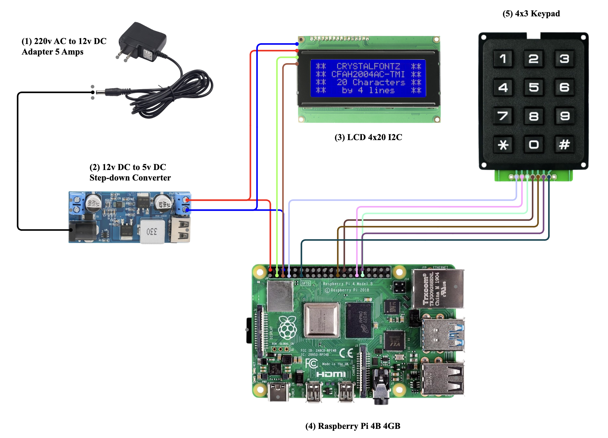

> Wiring diagram of the Raspberry Pi connected to the USB flatbed scanner,
> power supply, and any GPIO components used in the scanning station.

---

## 3D Model

<!-- Replace with your actual 3D render screenshots -->

| Front | Back | Assembled |
|:---:|:---:|:---:|
| 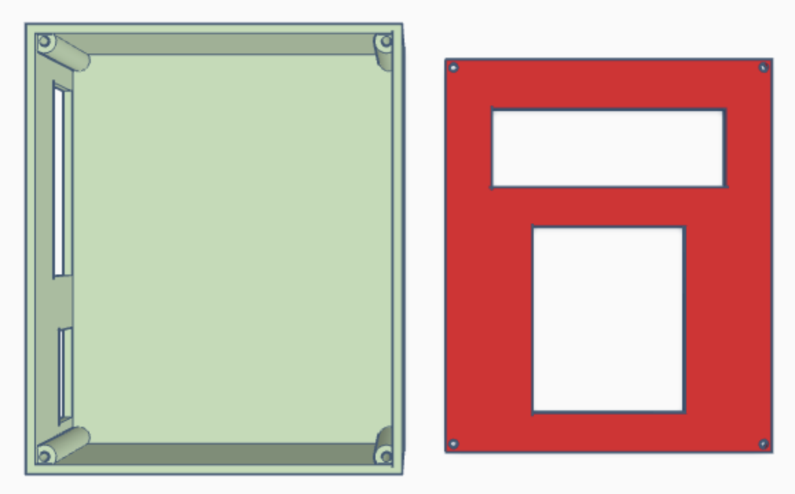 | 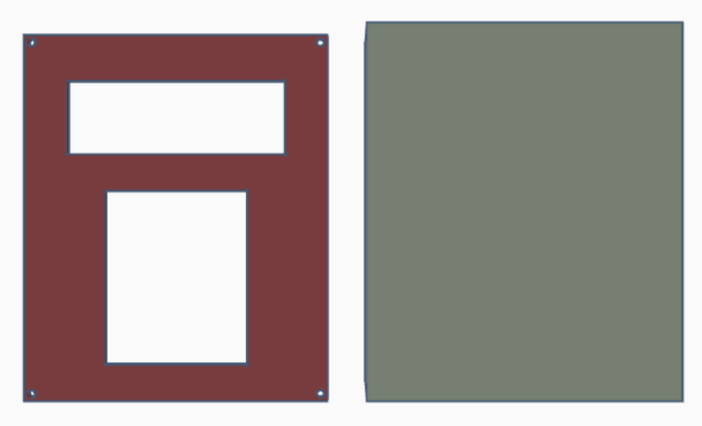 | 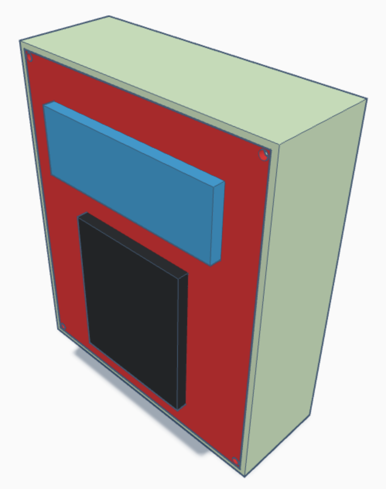 |

> **[⬇️ Download STL File (Google Drive)](https://drive.google.com/drive/folders/1htZS2gGShpGqaIfvgbmEBvvoWkSfhs8W?usp=sharing)**
>
> Recommended print settings: PLA, 0.2mm layer height, 20% infill.

---

## App UI Screenshots

| Main Portal | Teacher Login | Student Login |
|:---:|:---:|:---:|
| 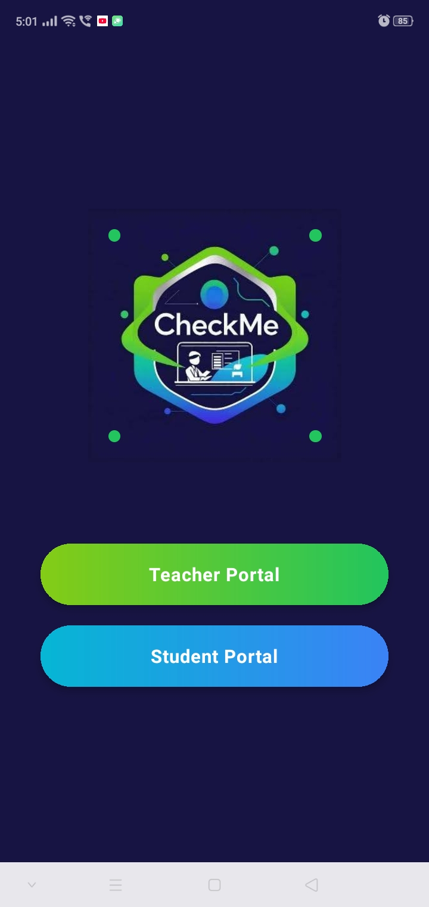 | 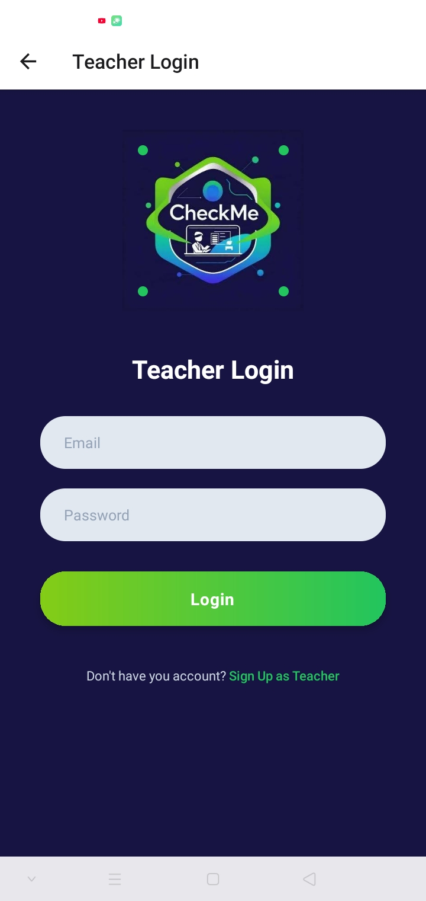 | 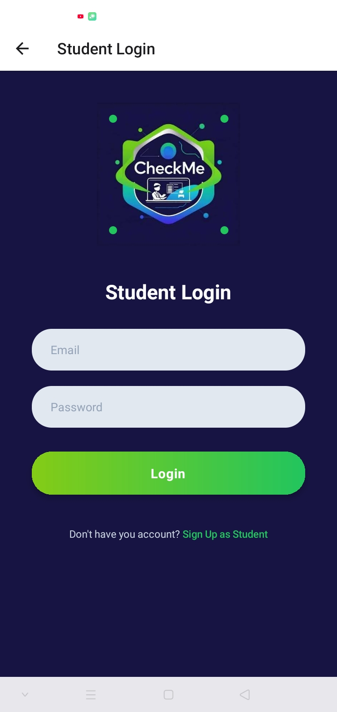 |
| Main portal where users choose between Teacher or Student authentication | Teacher login with email and password | Student login screen |

| Teacher Dashboard | Section Dashboard | Subject Dashboard |
|:---:|:---:|:---:|
| 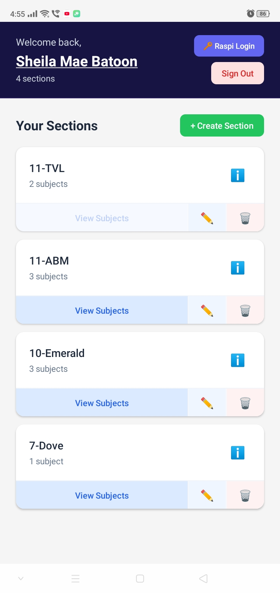 | 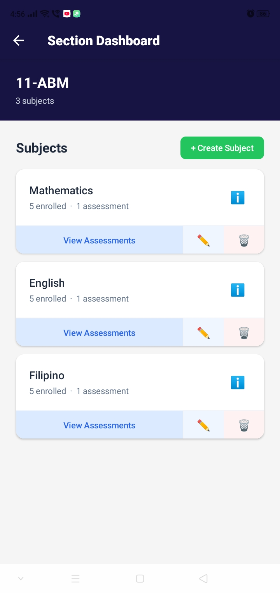 | 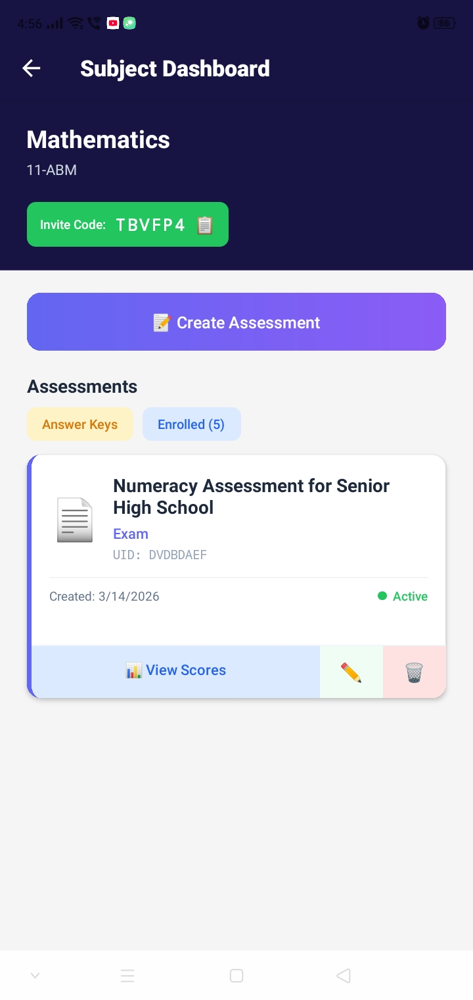 |
| Overview of all sections with View Subjects button | Subjects list with assessment counts and View Assessments button | Assessments list with UID, inline edit, create, and manage |

| Answer Keys | View Scores | Score Breakdown |
|:---:|:---:|:---:|
| 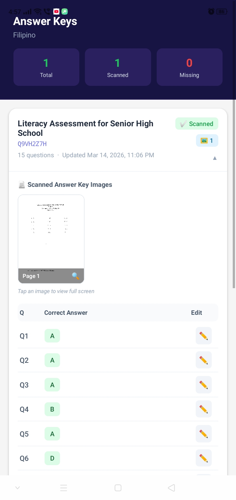 | 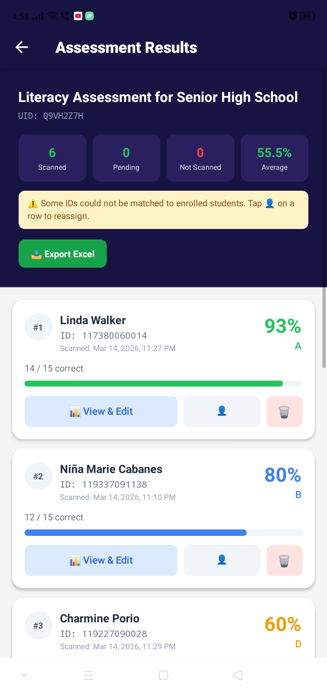 | 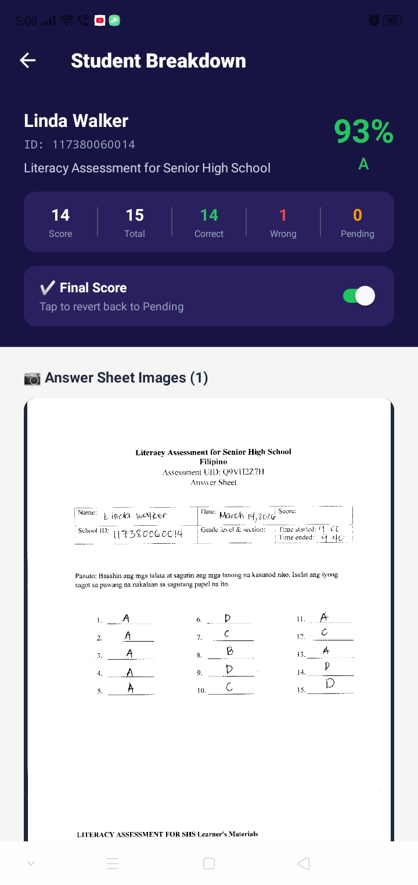 |
| Scanned answer keys with Share Publicly and per-question breakdown | Full class results with scores, grades, and Export Excel button | Per-question result with manual edit support |

| Export Excel | Student Dashboard | |
|:---:|:---:|:---:|
| 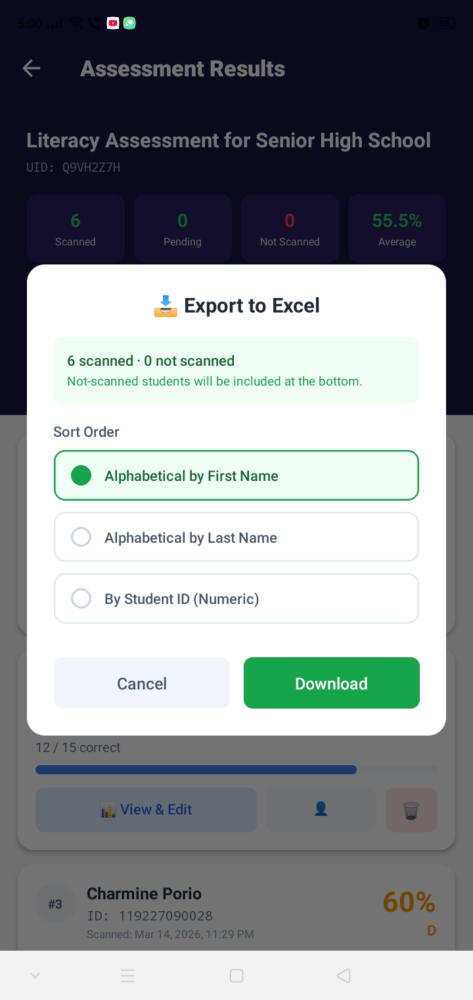 | 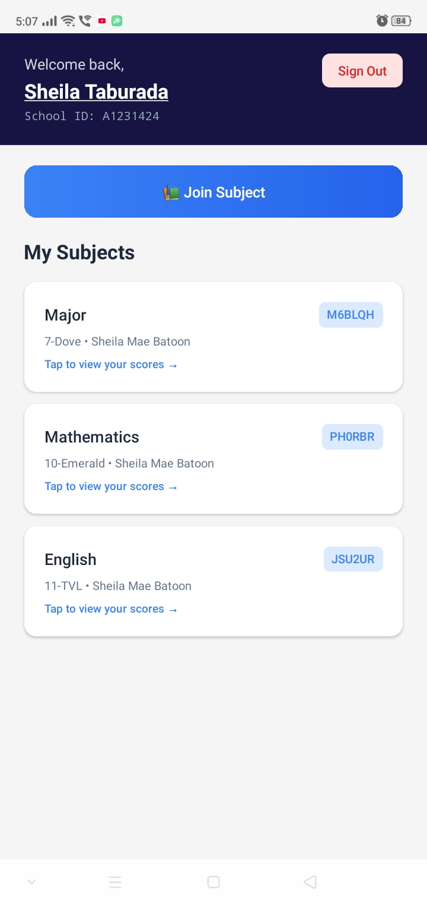 | |
| Sort options and download results as .xlsx | Student view of enrolled subjects and scores | |

---

## Downloads

### 📱 Android APK

> **[⬇️ Download CheckMe APK (Google Drive)](https://drive.google.com/drive/folders/1BjFJGvU9MaaUgBxwOaqnnwYfOpYkgsbK?usp=sharing)**
>
> Minimum Android version: API 21 (Android 5.0)
>
> **Install instructions:**
> 1. Download the APK on your Android phone
> 2. Go to **Settings → Security → Enable Install from unknown sources**
> 3. Open the APK and tap **Install**
> 4. Open CheckMe and sign in as a Teacher or Student

---

## Future Works

CheckMe was designed with extensibility in mind. The following features and
directions are planned or proposed for future development:

### 🖥️ Web or Desktop Application
A web-based or desktop version of the teacher portal would allow teachers to manage assessments, view scores, and export results directly from a browser or computer — without needing a mobile device. This would be particularly useful in school computer labs or for teachers who prefer a larger screen for data review.

### 🖨️ PC-Based Scanning (No Raspberry Pi Required)
The current system requires a Raspberry Pi as the dedicated scanning station. A future version could replace it entirely with a desktop or laptop application that communicates directly with a USB-connected scanner. Since most school computers already have scanner software installed, this would significantly reduce hardware costs and setup complexity, allowing any compatible PC to serve as a checking station.

### 👨‍💼 Admin Portal and Enhanced Security
A dedicated admin panel would allow school administrators to oversee all teacher accounts, subjects, sections, and assessment activity across the institution — providing a school-wide view without requiring access to individual teacher accounts. An approval-based registration flow would also be introduced, requiring admin authorization before new accounts are activated. This prevents unauthorized sign-ups and protects publicly shared answer keys from being accessed by non-teachers.

### 📊 Analytics Dashboard
Visual analytics for teachers showing class performance trends across assessments, including score distributions, question-level difficulty analysis, and individual student progress over time.

### 🔔 Push Notifications
Real-time push notifications to alert teachers when a student's answer sheet has been successfully scanned and scored, or when a student requests enrollment in their subject.

### 🌐 Broader Scanner Compatibility Testing
CheckMe has been confirmed working on the Epson L3210 Series and Canon PIXMA MG2570S. Future work includes formal compatibility testing across a wider range of flatbed scanner models to build a verified support list. Additionally, support for sheet-fed document scanners — such as the Epson WorkForce DS-410 — is being explored to enable batch scanning. This would allow multiple pages from multiple students (e.g., 4-page answer sheets for 30 students, totaling 120 pages) to be fed and processed in a single pass.

### 📱 Student Mobile Improvements
Enhanced student-facing features such as score history graphs, notifications when results are published, and the ability to view scanned answer sheet images alongside a personal score breakdown.

### 💰 Monetization and Usage Quota System
As CheckMe scales to more teachers and institutions, a subscription-based monetization model is planned. Teachers or schools would be offered tiered plans with defined monthly scan quotas. Usage will be tracked per account in the backend, and the system will enforce limits before invoking the Gemini API — blocking scans once a quota is reached and prompting an upgrade. This approach allows CheckMe to absorb API costs centrally while maintaining healthy margins, without requiring individual teachers to manage their own API billing. A per-school licensing model is also being considered, where a school admin pays a flat fee covering all teachers under their institution.

### 🔁 Gemini OCR Pipeline Optimization
The current implementation collages multiple scanned pages into a single image before sending it to Gemini for extraction. While functional, this approach increases token consumption and can reduce OCR accuracy when the combined image becomes very large. A planned improvement is to send each scanned page as a separate inline image within a single Gemini API request — a pattern now reliably supported by the updated Google Gen AI SDK. Additionally, native PDF input is being explored for future compatibility with sheet-fed scanners that output multi-page PDFs directly, which would eliminate the image conversion step entirely and further streamline the scanning pipeline.

### 🗂️ CheckMe Formatter
A dedicated Formatter screen is planned for both the teacher and student sides of the mobile app. Its purpose is to provide structured, printable templates — for answer keys and answer sheets — that are deliberately designed around the constraints and expectations of the Gemini OCR extraction pipeline.


On the teacher side, the Formatter would generate a clean answer key template that enforces CheckMe's format rules: continuous question numbering, clearly designated answer fields, and labeled sections for Multiple Choice, True/False, Enumeration, and Essay questions. Because the Gemini OCR prompt is designed to locate explicitly marked, circled, or written answers — and to distinguish them from printed choices and decorative marks — a well-structured template significantly reduces the likelihood of misreads or unreadable results.


On the student side, the Formatter would produce a standardized answer sheet that visually guides students on where and how to write their answers. This includes clearly labeled answer fields, explicit instructions for cancelling answers using strikethrough, and reminders to write True or False in full rather than using T or F. Since the OCR system relies on specific visual cues — circled letters, shaded bubbles, written text in blanks, and strikethroughs for cancellations — a purpose-built answer sheet reduces ambiguity and improves scoring accuracy across the board.


The Formatter does not replace free-form test papers but serves as an optional tool for teachers who want to maximize OCR reliability and minimize the need for manual corrections after scanning.

### 🗃️ CheckMe OS Image for Raspberry Pi

For institutions that prefer to keep using a Raspberry Pi as their scanning station, a pre-built CheckMe OS image is planned for release. Rather than manually setting up dependencies, configuring the scanner, and installing the application from scratch, users would simply flash the image onto an SD card and boot directly into a ready-to-use CheckMe environment. This significantly lowers the technical barrier for schools without dedicated IT support and ensures a consistent, stable setup across all Raspberry Pi deployments.

### 📷 Camera-Based Scanning

As an alternative to a physical flatbed scanner, a future update to the mobile app would introduce a built-in camera scanning feature. Teachers or students could photograph an answer key or answer sheet directly using their phone camera, which the app would then process and send to the Gemini OCR pipeline — eliminating the need for any external hardware entirely. This makes CheckMe accessible in settings where scanners are unavailable, and serves as a lightweight fallback for occasional use. Image quality guidelines would be provided in-app to help users capture clean, well-lit shots that the OCR can read reliably.

---

## Acknowledgments

- Google Firebase for real-time cloud infrastructure and RTDB
- Cloudinary for free-tier image hosting and CDN delivery
- Expo and the React Native community for the cross-platform mobile framework
- SANE Project for open-source scanner driver support on Linux / Raspberry Pi
- SheetJS (xlsx) for Excel file generation
- The teachers and students who participated in testing and provided feedback