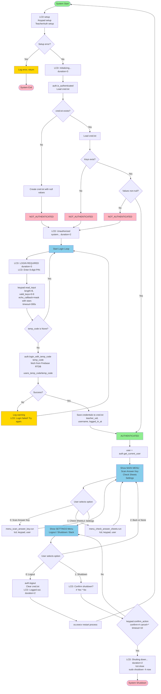

```mermaid
flowchart TD
    Start([System Start]) --> Setup[LCD setup
        Keypad setup
        TeacherAuth setup]

    Setup --> SetupError{Setup error?}
    SetupError -->|Yes| LogError[Log error, return]
    LogError --> End2([System Exit])
    SetupError -->|No| LCDInit[LCD: Initializing... duration=3]

    LCDInit --> CheckAuth[auth.is_authenticated
        Load cred.txt]

    CheckAuth --> CheckCred{cred.txt exists?}
    CheckCred -->|No| CreateCred[Create cred.txt with null values]
    CreateCred --> NotAuth1[NOT_AUTHENTICATED]

    CheckCred -->|Yes| LoadCred[Load cred.txt]
    LoadCred --> CheckKeys{Keys exist?}
    CheckKeys -->|No| NotAuth2[NOT_AUTHENTICATED]
    CheckKeys -->|Yes| CheckValues{Values non-null?}
    CheckValues -->|No| NotAuth3[NOT_AUTHENTICATED]
    CheckValues -->|Yes| Auth[AUTHENTICATED]

    NotAuth1 --> LoginScreen
    NotAuth2 --> LoginScreen
    NotAuth3 --> LoginScreen

    LoginScreen[LCD: Unauthorized system... duration=2] --> LoginLoop[Start Login Loop]
    LoginLoop --> LCDLogin[LCD: LOGIN REQUIRED duration=3
        LCD: Enter 8-digit PIN:]
    LCDLogin --> ReadCode[keypad.read_input
        length=8, valid_keys=0-9
        echo_callback=mask with stars
        timeout=300s]

    ReadCode --> CodeNone{temp_code is None?}
    CodeNone -->|Yes| LoginLoop
    CodeNone -->|No| ValidateCode[auth.login_with_temp_code temp_code
        fetch from Firebase RTDB
        users_temp_code/temp_code]

    ValidateCode --> CodeValid{Success?}
    CodeValid -->|No| LogWarning[Log warning
        LCD: Login failed! Try again.]
    LogWarning --> LoginLoop
    CodeValid -->|Yes| SaveCreds[Save credentials to cred.txt
        teacher_uid, username, logged_in_at]
    SaveCreds --> Auth

    Auth --> GetUser[user = auth.get_current_user]
    GetUser --> MainMenuLoop[Show MAIN MENU
        Scan Answer Key
        Check Sheets
        Settings]

    MainMenuLoop --> MainChoice{User selects option}

    MainChoice -->|0: Scan Answer Key| RunMenu1[menu_scan_answer_key.run
        lcd, keypad, user]
    RunMenu1 --> MainMenuLoop

    MainChoice -->|1: Check Sheets| RunMenu2[menu_check_answer_sheets.run
        lcd, keypad, user]
    RunMenu2 --> MainMenuLoop

    MainChoice -->|2: Settings| SettingsLoop[Show SETTINGS Menu
        Logout / Shutdown / Back]
    SettingsLoop --> SettingsChoice{User selects option}

    SettingsChoice -->|0: Logout| DoLogout[auth.logout
        Clear cred.txt
        LCD: Logged out. duration=2]
    DoLogout --> Restart[os.execv restart process]
    Restart --> Start

    SettingsChoice -->|1: Shutdown| ConfirmShutdown[LCD: Confirm shutdown?
        # Yes  * No]
    ConfirmShutdown --> ShutdownConfirmed{keypad.confirm_action
        confirm=# cancel=* timeout=10}
    ShutdownConfirmed -->|No| SettingsLoop
    ShutdownConfirmed -->|Yes| DoShutdown[LCD: Shutting down... duration=2
        lcd.close
        sudo shutdown -h now]
    DoShutdown --> End([System Shutdown])

    SettingsChoice -->|2: Back or None| MainMenuLoop

    style Start fill:#90EE90
    style End fill:#FFB6C1
    style End2 fill:#FFB6C1
    style Auth fill:#90EE90
    style NotAuth1 fill:#FFB6C1
    style NotAuth2 fill:#FFB6C1
    style NotAuth3 fill:#FFB6C1
    style LogError fill:#FFD700
    style LogWarning fill:#FFD700
    style MainMenuLoop fill:#87CEEB
    style SettingsLoop fill:#87CEEB
    style LoginLoop fill:#87CEEB
```