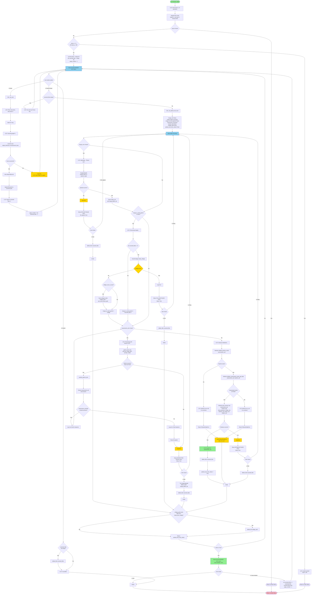

```mermaid
flowchart TD
    Start([run function called]) --> AskQuestions[LCD: Enter total no. of questions]
    AskQuestions --> ReadInput[keypad.read_input\nlength=2, end_key=#, timeout=300]
    
    ReadInput --> CheckInput{Input is None?}
    CheckInput -->|Yes| ReturnMenu1([Return to Main Menu])
    CheckInput -->|No| ValidateInput{total_q <= 0\nOR total_q > 99?}
    
    ValidateInput -->|Yes| ShowError[LCD: Invalid number!\nEnter 1-99]
    ShowError --> ReturnMenu2([Return to Main Menu])
    
    ValidateInput -->|No| InitVars[scanned_files = empty list\nall_scanned_files = empty list\npage_number = 1]
    
    InitVars --> MenuLoop[Show SCAN ANSWER KEY Menu]
    MenuLoop --> GetSelection{User selects option}
    
    GetSelection -->|0: Scan| DoScan[Call _do_scan]
    DoScan --> ScanPlace[LCD: Place document, then press #]
    ScanPlace --> ScanWait[Wait for # key]
    ScanWait --> ScanStart[LCD: Scanning page N...]
    ScanStart --> ScanExecute[scanner.scan\ntarget_directory=scans/answer_keys]
    
    ScanExecute --> ScanSuccess{Scan successful?}
    ScanSuccess -->|Yes| ScanDebounce[time.sleep debounce]
    ScanDebounce --> ScanAppend[Append filename to scanned_files]
    ScanAppend --> ScanShow[LCD: Page N scanned! Total: X]
    ScanShow --> IncrementPage[page_number = len scanned_files + 1]
    IncrementPage --> MenuLoop
    
    ScanSuccess -->|No| ScanError[Log error\nLCD: Scan failed! Try again.]
    ScanError --> MenuLoop
    
    GetSelection -->|1: Done & Save| CheckScans{scanned_files empty?}
    CheckScans -->|Yes| NoScansMsg[LCD: No scans yet! Scan first.]
    NoScansMsg --> MenuLoop
    
    CheckScans -->|No| CallUpload[Call _do_upload_and_save]
    
    CallUpload --> InitUploadVars[image_urls=None\nimage_public_ids=None\nimage_to_send_gemini=None\nassessment_uid=None\nanswer_key=None\ncollage_path=None\nupload_and_save_status=False]
    
    InitUploadVars --> UploadLoop[Start while True loop]
    
    UploadLoop --> CheckUrls{image_urls is None?}
    
    CheckUrls -->|Yes| LCDUpload[LCD: Uploading... Please wait.]
    LCDUpload --> TryUpload[ImageUploader\nupload_batch or upload_single]
    TryUpload --> UploadSuccess{Upload success?}
    UploadSuccess -->|Yes| StoreUrls[Store image_urls\nand image_public_ids]
    StoreUrls --> CheckCollage
    
    UploadSuccess -->|No| UploadError[Log error]
    UploadError --> UploadMenu[Show UPLOAD FAILED menu\nRe-upload / Exit]
    UploadMenu --> UploadChoice{User choice}
    UploadChoice -->|0: Re-upload| UploadLoop
    UploadChoice -->|1: Exit| DeleteFiles1[delete_files scanned_files]
    DeleteFiles1 --> BreakLoop1[break]
    
    CheckUrls -->|No| CheckCollage{image_to_send_gemini\nis None?}
    
    CheckCollage -->|Yes| LCDProcess[LCD: Processing images...]
    LCDProcess --> CheckMultiPage{len scanned_files > 1?}
    
    CheckMultiPage -->|Yes| CreateCollage[SmartCollage.create_collage]
    CreateCollage --> CollageError{Collage error?}
    CollageError -->|Yes| LogCollageError[Log error]
    LogCollageError --> CollageMenu[Show COLLAGE FAILED menu\nRetry / Exit]
    CollageMenu --> CollageChoice{User choice}
    CollageChoice -->|0: Retry| UploadLoop
    CollageChoice -->|1: Exit| DeleteFiles2[delete_files scanned_files]
    DeleteFiles2 --> BreakLoop2[break]
    
    CollageError -->|No| SaveCollageCheck{collage_save_to_local?}
    SaveCollageCheck -->|Yes| SaveCollage[Save collage to disk\ncollage_path = join_and_ensure_path]
    SaveCollage --> SetImageMulti[image_to_send_gemini = collage]
    SaveCollageCheck -->|No| SetImageMulti
    SetImageMulti --> CheckUID
    
    CheckMultiPage -->|No| SetImageSingle[image_to_send_gemini = scanned_files 0]
    SetImageSingle --> CheckUID
    
    CheckCollage -->|No| CheckUID{assessment_uid is None?}
    
    CheckUID -->|Yes| LCDGemini[LCD: Processing with Gemini OCR...]
    LCDGemini --> TryGemini[gemini_with_retry\napi_key, image_path, prompt, model]
    
    TryGemini --> GeminiSuccess{Gemini success?\nresult not None}
    GeminiSuccess -->|Yes| SanitizeJSON[sanitize_gemini_json]
    SanitizeJSON --> ExtractData[Extract assessment_uid\nand answers]
    ExtractData --> ValidateData{assessment_uid AND\nanswers present?}
    
    ValidateData -->|No| LogBadResponse[Log error: Bad response]
    LogBadResponse --> RaiseException[Raise Exception]
    RaiseException --> GeminiError
    
    ValidateData -->|Yes| LogDebug[Log raw Gemini response]
    LogDebug --> CheckUID
    
    GeminiSuccess -->|No| GeminiError[Log error]
    GeminiError --> GeminiMenu[Show EXTRACTION FAILED menu\nRetry / Exit]
    GeminiMenu --> GeminiChoice{User choice}
    GeminiChoice -->|0: Retry| UploadLoop
    GeminiChoice -->|1: Exit| CleanupCloudinary[Try ImageUploader\ndelete_batch image_public_ids]
    CleanupCloudinary --> DeleteFiles3[delete_files scanned_files]
    DeleteFiles3 --> BreakLoop3[break]
    
    CheckUID -->|No| LCDSaving[LCD: Saving to database...]
    LCDSaving --> ValidateTeacher[firebase.validate_teacher_exists\nuser.teacher_uid]
    
    ValidateTeacher --> TeacherValid{Teacher exists?}
    TeacherValid -->|No| LCDInvalidTeacher[LCD: INVALID user UID\n# to continue]
    LCDInvalidTeacher --> RaiseFirebaseDataError1[Raise FirebaseDataError]
    RaiseFirebaseDataError1 --> FirebaseDataErrorHandler
    
    TeacherValid -->|Yes| ValidateAssessment[firebase.validate_assessment_exists_get_data\nassessment_uid, teacher_uid]
    ValidateAssessment --> AssessmentValid{Assessment exists\nin RTDB?}
    AssessmentValid -->|No| LCDInvalidAss[LCD: INVALID ass_uid\n# to continue]
    LCDInvalidAss --> RaiseFirebaseDataError2[Raise FirebaseDataError]
    RaiseFirebaseDataError2 --> FirebaseDataErrorHandler
    
    AssessmentValid -->|Yes| TryFirebase[firebase.save_answer_key\nassessment_uid, answer_key,\ntotal_questions, image_urls,\nteacher_uid, section_uid, subject_uid]
    
    TryFirebase --> FirebaseSuccess{Firebase success?}
    FirebaseSuccess -->|Yes| LCDSaved[LCD: Saved! ID: assessment_uid]
    LCDSaved --> DeleteScans[delete_files scanned_files]
    DeleteScans --> SetStatusTrue[upload_and_save_status = True]
    SetStatusTrue --> BreakLoop4[break]
    
    FirebaseDataErrorHandler[Log FirebaseDataError\nwait_for_key #] --> BreakLoop4
    
    FirebaseSuccess -->|No| FirebaseError[Log error]
    FirebaseError --> FirebaseMenu[Show DATABASE FAILED menu\nRetry / Exit]
    FirebaseMenu --> FirebaseChoice{User choice}
    FirebaseChoice -->|0: Retry| UploadLoop
    FirebaseChoice -->|1: Exit| DeleteFiles4[delete_files scanned_files]
    DeleteFiles4 --> BreakLoop4
    
    BreakLoop1 --> CheckDeleteCollage
    BreakLoop2 --> CheckDeleteCollage
    BreakLoop3 --> CheckDeleteCollage
    BreakLoop4 --> CheckDeleteCollage
    
    CheckDeleteCollage{collage_path exists\nAND NOT keep_local_collage?}
    CheckDeleteCollage -->|Yes| DeleteCollage[delete_file collage_path]
    CheckDeleteCollage -->|No| ReturnStatus
    DeleteCollage --> ReturnStatus[Return upload_and_save_status]
    
    ReturnStatus --> CheckDone{done is True?}
    CheckDone -->|No| MenuLoop
    
    CheckDone -->|Yes| ScanAnotherMenu[Show SCAN ANSWER KEY menu\nScan Another / Exit]
    ScanAnotherMenu --> ScanAnotherChoice{User choice}
    
    ScanAnotherChoice -->|0: Scan Another| ResetState[all_scanned_files += scanned_files\nscanned_files.clear\npage_number = 1]
    ResetState --> MenuLoop
    
    ScanAnotherChoice -->|1: Exit| BreakMainLoop[break]
    
    GetSelection -->|2: Cancel| CheckFiles{scanned_files\nnot empty?}
    CheckFiles -->|Yes| DeleteFilesCancel[delete_files scanned_files]
    DeleteFilesCancel --> ShowCancelled
    CheckFiles -->|No| ShowCancelled[LCD: Cancelled.]
    ShowCancelled --> BreakMainLoop
    
    BreakMainLoop --> End([Return to Main Menu])
    ReturnMenu1 --> End
    ReturnMenu2 --> End

    style Start fill:#90EE90
    style End fill:#FFB6C1
    style UploadError fill:#FFD700
    style ScanError fill:#FFD700
    style CollageError fill:#FFD700
    style GeminiError fill:#FFD700
    style FirebaseError fill:#FFD700
    style FirebaseDataErrorHandler fill:#FFD700
    style LCDSaved fill:#90EE90
    style UploadLoop fill:#87CEEB
    style MenuLoop fill:#87CEEB
    style ScanAnotherMenu fill:#90EE90
```