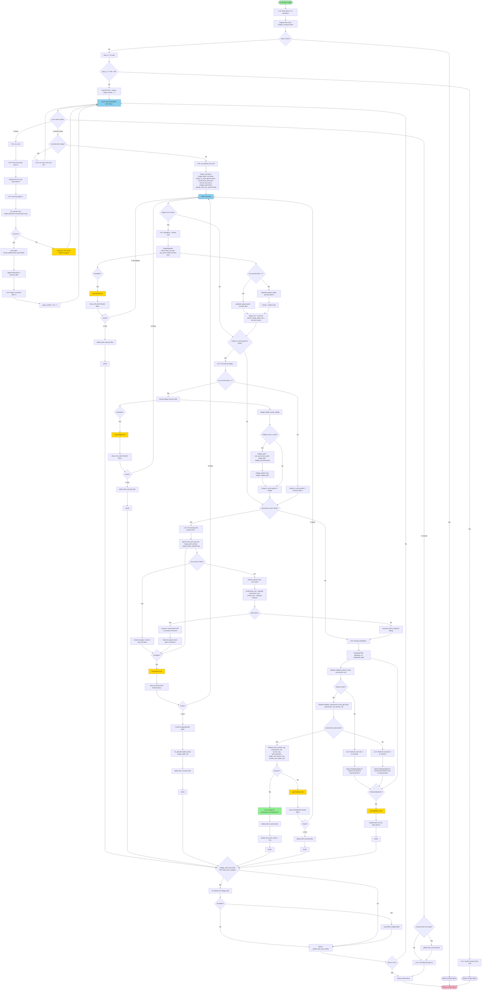

```mermaid
flowchart TD
    Start([run function called]) --> AskQuestions[LCD: Enter total no. of questions]
    AskQuestions --> ReadInput[keypad.read_input length=2, timeout=300s]
    
    ReadInput --> CheckInput{Input is None?}
    CheckInput -->|Yes| ReturnMenu1([Return to Main Menu])
    CheckInput -->|No| ConvertInt[total_q = int input]
    
    ConvertInt --> ValidateInput{total_q <= 0 OR > 99?}
    ValidateInput -->|Yes| ShowError[LCD: Invalid number! Enter 1-99]
    ShowError --> ReturnMenu2([Return to Main Menu])
    
    ValidateInput -->|No| InitVars[scanned_files = empty, page_number = 1]
    
    InitVars --> MenuLoop[Show SCAN ANSWER KEY Menu]
    MenuLoop --> GetSelection{User selects option}
    
    GetSelection -->|0: Scan| CallDoScan[Call _do_scan]
    CallDoScan --> ScanPlace[LCD: Place document, press #]
    ScanPlace --> ScanWait[keypad.wait_for_key valid_keys=#]
    ScanWait --> ScanStart[LCD: Scanning page N...]
    ScanStart --> ScanTry[Try scanner.scan target_directory=scans/answer_keys]
    
    ScanTry --> ScanSuccess{Success?}
    ScanSuccess -->|Yes| ScanDebounce[time.sleep SCAN_DEBOUNCE_SECONDS]
    ScanDebounce --> ScanAppend[Append filename to scanned_files]
    ScanAppend --> ScanShow[LCD: Page N scanned! Total: X]
    ScanShow --> IncrementPage[page_number = len + 1]
    IncrementPage --> MenuLoop
    
    ScanSuccess -->|No| ScanError[Log error, LCD: Scan failed! Try again]
    ScanError --> MenuLoop
    
    GetSelection -->|1: Done & Save| CheckScans{scanned_files empty?}
    CheckScans -->|Yes| NoScansMsg[LCD: No scans yet! Scan first.]
    NoScansMsg --> MenuLoop
    
    CheckScans -->|No| CallUpload[Call _do_upload_and_save]
    
    CallUpload --> InitUploadVars[image_urls=None, image_public_ids=None, image_to_send_gemini=None, assessment_uid=None, answer_key=None, collage_path=None, upload_and_save_status=False]
    
    InitUploadVars --> UploadLoop[while True loop]
    
    UploadLoop --> CheckUrls{image_urls is None?}
    CheckUrls -->|No| CheckCollage{image_to_send_gemini is None?}
    
    CheckUrls -->|Yes| LCDUpload[LCD: Uploading... Please wait]
    LCDUpload --> CreateUploader[ImageUploader cloud_name, api_key, api_secret, folder=answer-keys]
    CreateUploader --> CheckFileCount{len scanned_files > 1?}
    
    CheckFileCount -->|Yes| BatchUpload[uploader.upload_batch scanned_files]
    CheckFileCount -->|No| SingleUpload[uploader.upload_single scanned_files 0]
    SingleUpload --> WrapSingle[results = single result]
    BatchUpload --> StoreUrls
    WrapSingle --> StoreUrls[image_urls = urls from results, image_public_ids = ids from results]
    
    StoreUrls --> CheckCollage
    
    CreateUploader --> UploadError{Exception?}
    UploadError -->|Yes| LogUploadError[Log Upload error]
    LogUploadError --> UploadMenu[Show UPLOAD FAILED Menu]
    UploadMenu --> UploadChoice{choice?}
    UploadChoice -->|0: Re-upload| UploadLoop
    UploadChoice -->|1: Exit| DeleteFiles1[delete_files scanned_files]
    DeleteFiles1 --> BreakLoop1[break]
    
    CheckCollage -->|No| CheckUID{assessment_uid is None?}
    
    CheckCollage -->|Yes| LCDProcess[LCD: Processing images...]
    LCDProcess --> CheckMultiPage{len scanned_files > 1?}
    
    CheckMultiPage -->|Yes| CreateCollageObj[SmartCollage scanned_files]
    CreateCollageObj --> BuildCollage[collage_builder.create_collage]
    BuildCollage --> CheckSaveLocal{collage_save_to_local?}
    
    CheckSaveLocal -->|Yes| BuildPath[collage_path = join_and_ensure_path target_path, collage_timestamp.png]
    BuildPath --> SaveCollageDisk[collage_builder.save image, collage_path]
    SaveCollageDisk --> SetImageMulti[image_to_send_gemini = collage]
    
    CheckSaveLocal -->|No| SetImageMulti
    SetImageMulti --> CheckUID
    
    CheckMultiPage -->|No| SetImageSingle[image_to_send_gemini = scanned_files 0]
    SetImageSingle --> CheckUID
    
    CreateCollageObj --> CollageError{Exception?}
    CollageError -->|Yes| LogCollageError[Log Collage error]
    LogCollageError --> CollageMenu[Show COLLAGE FAILED Menu]
    CollageMenu --> CollageChoice{choice?}
    CollageChoice -->|0: Retry| UploadLoop
    CollageChoice -->|1: Exit| DeleteFiles2[delete_files scanned_files]
    DeleteFiles2 --> BreakLoop2[break]
    
    CheckUID -->|No| ValidateTeacher
    
    CheckUID -->|Yes| LCDGemini[LCD: Processing with Gemini OCR...]
    LCDGemini --> TryGemini[gemini_with_retry api_key, image_path, prompt, model, prefer_method=sdk]
    
    TryGemini --> CheckRawResult{raw_result is None?}
    CheckRawResult -->|Yes| RaiseNone[Raise Exception: Gemini returned None]
    RaiseNone --> GeminiError
    
    CheckRawResult -->|No| SanitizeJSON[sanitize_gemini_json raw_result]
    SanitizeJSON --> ExtractData[assessment_uid = data.get assessment_uid, answer_key = data.get answers]
    ExtractData --> ValidateExtracted{Both None?}
    
    ValidateExtracted -->|Yes| LogBadResponse[Log error: Assessment UID or Answers not found]
    LogBadResponse --> RaiseException[Raise Exception: Bad gemini response]
    RaiseException --> GeminiError
    
    ValidateExtracted -->|No| LogDebug[Log Raw Gemini response debug]
    LogDebug --> ValidateTeacher
    
    TryGemini --> GeminiError{Exception?}
    GeminiError -->|Yes| LogGeminiError[Log Gemini error]
    LogGeminiError --> GeminiMenu[Show EXTRACTION FAILED Menu]
    GeminiMenu --> GeminiChoice{choice?}
    GeminiChoice -->|0: Retry| UploadLoop
    GeminiChoice -->|1: Exit| RecreateUploader[Create ImageUploader again]
    RecreateUploader --> TryDeleteBatch[Try uploader.delete_batch image_public_ids]
    TryDeleteBatch --> DeleteFiles3[delete_files scanned_files]
    DeleteFiles3 --> BreakLoop3[break]
    
    ValidateTeacher[LCD: Saving to database...] --> CreateFirebase[FirebaseRTDB database_url, credentials_path]
    CreateFirebase --> ValidateTeacherExists[firebase.validate_teacher_exists user.teacher_uid]
    
    ValidateTeacherExists --> TeacherCheck{Teacher exists?}
    TeacherCheck -->|No| LCDInvalidUser[LCD: INVALID user UID, # to continue]
    LCDInvalidUser --> RaiseTeacherError[Raise FirebaseDataError: Teacher not found in /users/teachers/]
    RaiseTeacherError --> ValidationError
    
    TeacherCheck -->|Yes| ValidateAssessment[firebase.validate_assessment_exists_get_data assessment_uid, teacher_uid]
    
    ValidateAssessment --> AssessmentCheck{assessment_data exists?}
    AssessmentCheck -->|No| LCDInvalidAssess[LCD: INVALID assesUid, # to continue]
    LCDInvalidAssess --> RaiseAssessError[Raise FirebaseDataError: Assessment doesn't exist in /assessments/]
    RaiseAssessError --> ValidationError
    
    AssessmentCheck -->|Yes| SaveToRTDB[firebase.save_answer_key assessment_uid, answer_key, total_questions, image_urls, teacher_uid, section_uid, subject_uid]
    
    SaveToRTDB --> SaveSuccess{Success?}
    SaveSuccess -->|Yes| LCDSaved[LCD: Saved! ID: assessment_uid duration=3]
    LCDSaved --> DeleteScansSuccess[delete_files scanned_files]
    DeleteScansSuccess --> SetStatusTrue[upload_and_save_status = True]
    SetStatusTrue --> BreakLoop4[break]
    
    SaveSuccess -->|No| FirebaseError[Log Firebase error]
    FirebaseError --> FirebaseMenu[Show DATABASE FAILED Menu]
    FirebaseMenu --> FirebaseChoice{choice?}
    FirebaseChoice -->|0: Retry| UploadLoop
    FirebaseChoice -->|1: Exit| DeleteFiles5[delete_files scanned_files]
    DeleteFiles5 --> BreakLoop5[break]
    
    CreateFirebase --> ValidationError{FirebaseDataError?}
    ValidationError -->|Yes| LogValidationError[Log Validation error]
    LogValidationError --> WaitForKey[keypad.wait_for_key valid_keys=#]
    WaitForKey --> BreakLoop6[break]
    
    BreakLoop1 --> CheckDeleteCollage
    BreakLoop2 --> CheckDeleteCollage
    BreakLoop3 --> CheckDeleteCollage
    BreakLoop4 --> CheckDeleteCollage
    BreakLoop5 --> CheckDeleteCollage
    BreakLoop6 --> CheckDeleteCollage
    
    CheckDeleteCollage{collage_path exists AND NOT keep_local_collage?}
    CheckDeleteCollage -->|Yes| TryDelete[Try delete_file collage_path]
    TryDelete --> DeleteError{Exception?}
    DeleteError -->|Yes| LogDeleteError[Log Delete collage failed]
    DeleteError -->|No| ReturnStatus
    CheckDeleteCollage -->|No| ReturnStatus[Return upload_and_save_status]
    LogDeleteError --> ReturnStatus
    
    ReturnStatus --> CheckDone{done is True?}
    CheckDone -->|Yes| BreakMainLoop[break to Main Menu]
    CheckDone -->|No| MenuLoop
    
    GetSelection -->|2: Cancel| CheckFiles{scanned_files not empty?}
    CheckFiles -->|Yes| DeleteFilesCancel[delete_files scanned_files]
    CheckFiles -->|No| ShowCancelled[LCD: Cancelled duration=2]
    DeleteFilesCancel --> ShowCancelled
    ShowCancelled --> BreakMainLoop
    
    BreakMainLoop --> End([Return to Main Menu])
    ReturnMenu1 --> End
    ReturnMenu2 --> End

    style Start fill:#90EE90
    style End fill:#FFB6C1
    style LogUploadError fill:#FFD700
    style ScanError fill:#FFD700
    style LogCollageError fill:#FFD700
    style LogGeminiError fill:#FFD700
    style FirebaseError fill:#FFD700
    style LogValidationError fill:#FFD700
    style LCDSaved fill:#90EE90
    style UploadLoop fill:#87CEEB
    style MenuLoop fill:#87CEEB
```