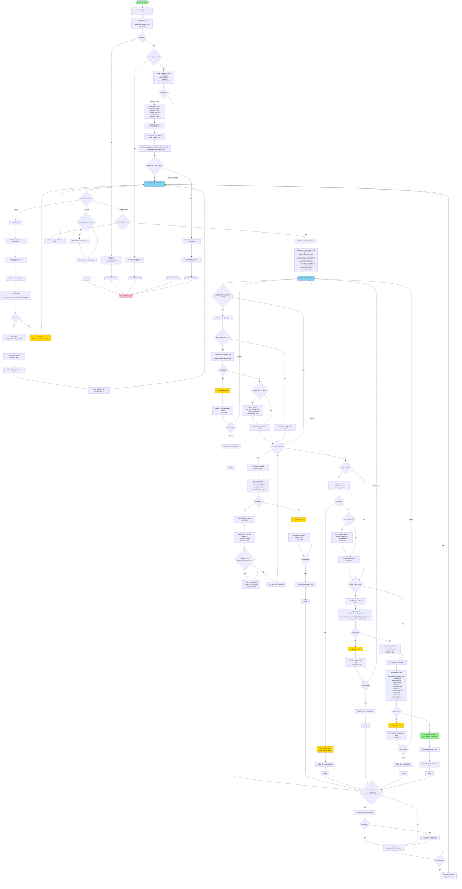

```mermaid
flowchart TD
    Start([run function called]) --> LCDLoadKeys[LCD: Loading answer keys...]
    LCDLoadKeys --> TryGetKeys[FirebaseRTDB init
        firebase.get_answer_keys teacher_uid]

    TryGetKeys --> GetKeysSuccess{Success?}
    GetKeysSuccess -->|No| LoadFailed[Log error
        LCD: Failed to load answer keys.]
    LoadFailed --> ReturnMenu1([Return to Main Menu])

    GetKeysSuccess -->|Yes| CheckEmpty{answer_keys empty?}
    CheckEmpty -->|Yes| NoKeys[LCD: No answer keys!
        Scan key first.]
    NoKeys --> ReturnMenu2([Return to Main Menu])

    CheckEmpty -->|No| ShowAssessmentMenu[show_scrollable_menu
        SELECT ASSESSMENT
        options = assessment_uid list]
    ShowAssessmentMenu --> AssessmentChoice{User choice}
    AssessmentChoice -->|None - cancelled| ReturnMenu3([Return to Main Menu])
    AssessmentChoice -->|selected_index| SetAssessment[assessment_uid = assessment_options selected_index
        answer_key_data = answer_keys selected_index]
    SetAssessment --> LCDAssessment[LCD: Assessment: assessment_uid]

    LCDAssessment --> InitVars[scanned_files = empty list
        page_number = 1]

    InitVars --> ValidateAssessment[firebase.validate_assessment_exists_get_data
        assessment_uid, teacher_uid]
    ValidateAssessment --> AssessmentValid{assessment_data exists?}
    AssessmentValid -->|No| LCDInvalidAss[LCD: INVALID assesUid
        # to continue]
    LCDInvalidAss --> WaitKey[keypad.wait_for_key valid_keys=#]
    WaitKey --> ReturnMenu4([Return to Main Menu])

    AssessmentValid -->|Yes| MenuLoop[Show CHECK SHEETS Menu]
    MenuLoop --> GetSelection{User selects option}

    GetSelection -->|0: Scan| DoScan[Call _do_scan]
    DoScan --> ScanPlace[LCD: Place document, then press #]
    ScanPlace --> ScanWait[keypad.wait_for_key valid_keys=#]
    ScanWait --> ScanStart[LCD: Scanning page N...]
    ScanStart --> ScanExecute[scanner.scan
        target_directory=ANSWER_SHEETS_PATH]

    ScanExecute --> ScanSuccess{Success?}
    ScanSuccess -->|Yes| ScanDebounce[time.sleep SCAN_DEBOUNCE_SECONDS]
    ScanDebounce --> ScanAppend[Append filename to scanned_files]
    ScanAppend --> ScanShow[LCD: Page N scanned! Total: X]
    ScanShow --> IncrementPage[page_number = len scanned_files + 1]
    IncrementPage --> MenuLoop

    ScanSuccess -->|No| ScanError[Log error
        LCD: Scan failed! Try again.]
    ScanError --> MenuLoop

    GetSelection -->|1: Done & Save| CheckScans{scanned_files empty?}
    CheckScans -->|Yes| NoScansMsg[LCD: No scans yet! Scan first.]
    NoScansMsg --> MenuLoop

    CheckScans -->|No| CallUpload[Call _do_upload_and_save]

    CallUpload --> InitUploadVars[upload_and_save_status=False
        image_urls=None, image_public_ids=None
        image_to_send_gemini=None
        student_id=None, student_answers=None
        score=None, total=None
        breakdown=None, collage_path=None
        is_final_score=False]

    InitUploadVars --> UploadLoop[Start while True loop]

    UploadLoop --> CheckCollage{image_to_send_gemini is None?}

    CheckCollage -->|Yes| LCDProcess[LCD: Processing images...]
    LCDProcess --> CheckMultiPage{len scanned_files > 1?}

    CheckMultiPage -->|Yes| CreateCollage[SmartCollage scanned_files
        collage_builder.create_collage]
    CreateCollage --> CollageError{Exception?}
    CollageError -->|Yes| LogCollageError[Log Collage error]
    LogCollageError --> CollageMenu[Show COLLAGE FAILED menu
        Retry / Exit]
    CollageMenu --> CollageChoice{User choice}
    CollageChoice -->|0: Retry| UploadLoop
    CollageChoice -->|1: Exit| DeleteFiles1[delete_files scanned_files]
    DeleteFiles1 --> BreakLoop1[break]

    CollageError -->|No| CheckSaveLocal{collage_save_to_local?}
    CheckSaveLocal -->|Yes| SaveCollage[collage_path = join_and_ensure_path
        collage_builder.save image collage_path]
    SaveCollage --> SetImageMulti[image_to_send_gemini = collage]
    CheckSaveLocal -->|No| SetImageMulti
    SetImageMulti --> CheckStudentID

    CheckMultiPage -->|No| SetImageSingle[image_to_send_gemini = scanned_files 0]
    SetImageSingle --> CheckStudentID

    CheckCollage -->|No| CheckStudentID{student_id is None?}

    CheckStudentID -->|Yes| LCDGemini[LCD: Processing with Gemini OCR...]
    LCDGemini --> TryGemini[gemini_with_retry
        api_key, image_path
        answer_sheet_prompt total_questions
        model, prefer_method]

    TryGemini --> GeminiError{Exception?}
    GeminiError -->|Yes| LogGeminiError[Log Gemini error]
    LogGeminiError --> GeminiMenu[Show EXTRACTION FAILED menu
        Retry / Exit]
    GeminiMenu --> GeminiChoice{User choice}
    GeminiChoice -->|0: Retry| UploadLoop
    GeminiChoice -->|1: Exit| DeleteFiles2[delete_files scanned_files]
    DeleteFiles2 --> BreakLoop2[break]

    GeminiError -->|No| SanitizeJSON[sanitize_gemini_json raw_result]
    SanitizeJSON --> ExtractData[student_id = data.get student_id
        student_answers = data.get answers]
    ExtractData --> ValidateData{student_id OR
        student_answers is None?}

    ValidateData -->|Yes| LogBadResponse[Log error: Missing
        student_id or answers
        Raise Exception]
    LogBadResponse --> GeminiError

    ValidateData -->|No| LogDebug[Log raw Gemini response]
    LogDebug --> CheckStudentID

    CheckStudentID -->|No| CheckScore{score is None?}

    CheckScore -->|Yes| TryCompare[compare_answers
        student_answers, answer_key_data]
    TryCompare --> CompareError{Exception?}
    CompareError -->|Yes| LogScoreError[Log Scoring error
        LCD: Scoring failed!]
    LogScoreError --> DeleteFiles3[delete_files scanned_files]
    DeleteFiles3 --> BreakLoop3[break]

    CompareError -->|No| CheckWarning{found_warning?}
    CheckWarning -->|Yes| ShowWarning[LCD: WARN: total != answer_sheets_len
        qty mismatch duration=3]
    ShowWarning --> ShowScore
    CheckWarning -->|No| ShowScore[LCD: Score: score/total duration=2]
    ShowScore --> CheckScoreStep

    CheckScore -->|No| CheckScoreStep{image_urls is None?}

    CheckScoreStep -->|Yes| LCDUpload[LCD: Uploading... Please wait.]
    LCDUpload --> TryUpload[ImageUploader
        cloud_name, api_key, api_secret
        folder=CLOUDINARY_ANSWER_SHEETS_PATH
        upload_batch or upload_single]
    TryUpload --> UploadError{Exception?}
    UploadError -->|Yes| LogUploadError[Log Upload error]
    LogUploadError --> UploadMenu[Show UPLOAD FAILED menu
        Re-upload / Exit]
    UploadMenu --> UploadChoice{User choice}
    UploadChoice -->|0: Re-upload| UploadLoop
    UploadChoice -->|1: Exit| DeleteFiles4[delete_files scanned_files]
    DeleteFiles4 --> BreakLoop4[break]

    UploadError -->|No| StoreUrls[image_urls = urls from results
        image_public_ids = ids from results]
    StoreUrls --> SaveRTDB

    CheckScoreStep -->|No| SaveRTDB[LCD: Saving to database...]
    SaveRTDB --> TryFirebase[FirebaseRTDB init
        firebase.save_student_result
        student_id, assessment_uid
        answer_sheet, total_score
        total_questions, image_urls
        image_public_ids, teacher_uid
        is_final_score, section_uid
        subject_uid, breakdown]

    TryFirebase --> FirebaseError{Exception?}
    FirebaseError -->|Yes| LogFirebaseError[Log Firebase error]
    LogFirebaseError --> FirebaseMenu[Show DATABASE FAILED menu
        Retry / Exit]
    FirebaseMenu --> FirebaseChoice{User choice}
    FirebaseChoice -->|0: Retry| UploadLoop
    FirebaseChoice -->|1: Exit| DeleteFiles5[delete_files scanned_files]
    DeleteFiles5 --> BreakLoop5[break]

    FirebaseError -->|No| LCDSaved[LCD: Saved! score/total
        ID: student_id duration=3]
    LCDSaved --> DeleteScans[delete_files scanned_files]
    DeleteScans --> SetStatusTrue[upload_and_save_status = True]
    SetStatusTrue --> BreakLoop6[break]

    BreakLoop1 --> CheckDeleteCollage
    BreakLoop2 --> CheckDeleteCollage
    BreakLoop3 --> CheckDeleteCollage
    BreakLoop4 --> CheckDeleteCollage
    BreakLoop5 --> CheckDeleteCollage
    BreakLoop6 --> CheckDeleteCollage

    CheckDeleteCollage{collage_path exists
        AND NOT keep_local_collage?}
    CheckDeleteCollage -->|Yes| TryDeleteCollage[Try delete_file collage_path]
    TryDeleteCollage --> DeleteCollageError{Exception?}
    DeleteCollageError -->|Yes| LogDeleteError[Log Delete collage failed]
    DeleteCollageError -->|No| ReturnStatus
    CheckDeleteCollage -->|No| ReturnStatus[Return upload_and_save_status]
    LogDeleteError --> ReturnStatus

    ReturnStatus --> CheckDone{done is True?}
    CheckDone -->|Yes| ResetState[scanned_files.clear
        page_number = 1]
    ResetState --> MenuLoop
    CheckDone -->|No| MenuLoop

    GetSelection -->|2: Cancel| CheckFiles{scanned_files not empty?}
    CheckFiles -->|Yes| DeleteFilesCancel[delete_files scanned_files]
    DeleteFilesCancel --> ShowCancelled
    CheckFiles -->|No| ShowCancelled[LCD: Cancelled. duration=2]
    ShowCancelled --> BreakMainLoop[break]

    BreakMainLoop --> End([Return to Main Menu])
    ReturnMenu1 --> End
    ReturnMenu2 --> End
    ReturnMenu3 --> End
    ReturnMenu4 --> End

    style Start fill:#90EE90
    style End fill:#FFB6C1
    style ScanError fill:#FFD700
    style LogCollageError fill:#FFD700
    style LogGeminiError fill:#FFD700
    style LogUploadError fill:#FFD700
    style LogFirebaseError fill:#FFD700
    style LogScoreError fill:#FFD700
    style LCDSaved fill:#90EE90
    style UploadLoop fill:#87CEEB
    style MenuLoop fill:#87CEEB
```