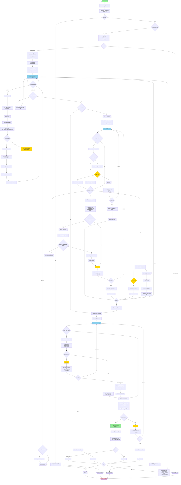

```mermaid
flowchart TD
    Start([run function called]) --> LCDLoadKeys[LCD: Loading answer keys...]
    LCDLoadKeys --> TryGetKeys[firebase.get_answer_keys teacher_uid]

    TryGetKeys --> GetKeysSuccess{Success?}
    GetKeysSuccess -->|No| LoadFailed[Log error, LCD: Failed to load answer keys.]
    LoadFailed --> ReturnMenu1([Return to Main Menu])

    GetKeysSuccess -->|Yes| CheckEmpty{answer_keys empty?}
    CheckEmpty -->|Yes| NoKeys[LCD: No answer keys! Scan key first.]
    NoKeys --> ReturnMenu2([Return to Main Menu])

    CheckEmpty -->|No| ShowAssessmentMenu[show_scrollable_menu
        SELECT ASSESSMENT
        options = assessment_uid list]
    ShowAssessmentMenu --> AssessmentChoice{User choice}
    AssessmentChoice -->|None - cancelled| ReturnMenu3([Return to Main Menu])
    AssessmentChoice -->|selected_index| SetAssessment[assessment_uid = assessment_options selected_index
        answer_key_data = answer_keys selected_index]
    SetAssessment --> LCDAssessment[LCD: Assessment: assessment_uid]

    LCDAssessment --> InitVars[scanned_files = empty list
        page_number = 1
        is_gemini_task_done = False
        gemini_result = None]

    InitVars --> MenuLoop[Show CHECK SHEETS Menu]
    MenuLoop --> GetSelection{User selects option}

    GetSelection -->|0: Scan| DoScan[Call _do_scan]
    DoScan --> ScanPlace[LCD: Place document, then press #]
    ScanPlace --> ScanWait[Wait for # key]
    ScanWait --> ScanStart[LCD: Scanning page N...]
    ScanStart --> ScanExecute[scanner.scan target_directory=scans/answer_sheets]

    ScanExecute --> ScanSuccess{Scan successful?}
    ScanSuccess -->|Yes| ScanDebounce[time.sleep debounce]
    ScanDebounce --> ScanAppend[Append filename to scanned_files]
    ScanAppend --> ScanShow[LCD: Page N scanned! Total: X]
    ScanShow --> ResetGemini[is_gemini_task_done = False]
    ResetGemini --> IncrementPage[page_number = len scanned_files + 1]
    IncrementPage --> MenuLoop

    ScanSuccess -->|No| ScanError[Log error, LCD: Scan failed! Try again.]
    ScanError --> MenuLoop

    GetSelection -->|1: Done & Save| CheckScans{scanned_files empty?}
    CheckScans -->|Yes| NoScansMsg[LCD: No scans yet! Scan first.]
    NoScansMsg --> MenuLoop

    CheckScans -->|No| CheckGeminiDone{is_gemini_task_done?}

    CheckGeminiDone -->|No| CallGemini[Call _do_gemini_ocr]

    CallGemini --> InitGeminiVars[image_to_send_gemini=None
        student_id=None
        student_answers=None
        collage_path=None]
    InitGeminiVars --> GeminiLoop[Start while True loop]

    GeminiLoop --> CheckCollage{image_to_send_gemini is None?}

    CheckCollage -->|Yes| LCDProcess[LCD: Processing images...]
    LCDProcess --> CheckMultiPage{len scanned_files > 1?}

    CheckMultiPage -->|Yes| CreateCollage[SmartCollage.create_collage
        save collage to disk]
    CreateCollage --> CollageError{Collage error?}
    CollageError -->|Yes| LogCollageError[Log error]
    LogCollageError --> CollageMenu[Show COLLAGE FAILED menu
        Retry / Exit]
    CollageMenu --> CollageChoice{User choice}
    CollageChoice -->|0: Retry| GeminiLoop
    CollageChoice -->|1: Exit| DeleteCollage1[delete_file collage_path if exists]
    DeleteCollage1 --> ReturnFalse1[Return False, None]

    CollageError -->|No| SetImageMulti[image_to_send_gemini = collage]
    SetImageMulti --> CheckStudentID

    CheckMultiPage -->|No| SetImageSingle[image_to_send_gemini = scanned_files 0]
    SetImageSingle --> CheckStudentID

    CheckCollage -->|No| CheckStudentID{student_id is None?}

    CheckStudentID -->|Yes| LCDGemini[LCD: Processing with Gemini OCR...]
    LCDGemini --> TryGemini[gemini_with_retry
        api_key, image_path, answer_sheet_prompt, model]

    TryGemini --> GeminiSuccess{Gemini success? result not None}
    GeminiSuccess -->|Yes| SanitizeJSON[sanitize_gemini_json]
    SanitizeJSON --> ExtractData[Extract student_id and answers]
    ExtractData --> ValidateData{student_id AND answers present?}

    ValidateData -->|No| LogBadResponse[Log error: Missing student_id or answers]
    LogBadResponse --> RaiseException[Raise Exception]
    RaiseException --> GeminiError

    ValidateData -->|Yes| LogDebug[Log raw Gemini response]
    LogDebug --> CheckStudentID

    GeminiSuccess -->|No| GeminiError[Log error]
    GeminiError --> GeminiMenu[Show EXTRACTION FAILED menu
        Retry / Exit]
    GeminiMenu --> GeminiChoice{User choice}
    GeminiChoice -->|0: Retry| GeminiLoop
    GeminiChoice -->|1: Exit| DeleteCollage2[delete_file collage_path if exists]
    DeleteCollage2 --> ReturnFalse2[Return False, None]

    CheckStudentID -->|No| CompareAnswers[_compare_answers
        student_answers vs answer_key_data]
    CompareAnswers --> CalcScore[score, total, breakdown]
    CalcScore --> LCDScore[LCD: Score: X/Y]
    LCDScore --> DeleteCollageFinal[delete_file collage_path if exists]
    DeleteCollageFinal --> ReturnTrue[Return True, gemini_result dict]

    CompareAnswers --> ScoringError{Scoring error?}
    ScoringError -->|Yes| LogScoringError[Log error, LCD: Scoring failed!]
    LogScoringError --> ReturnFalse3[Return False, None]

    ReturnFalse1 --> GeminiOutcome
    ReturnFalse2 --> GeminiOutcome
    ReturnFalse3 --> GeminiOutcome
    ReturnTrue --> GeminiOutcome

    GeminiOutcome{success?}
    GeminiOutcome -->|No| MenuLoop
    GeminiOutcome -->|Yes| SetGeminiDone[is_gemini_task_done = True
        gemini_result = result]

    CheckGeminiDone -->|Yes| CallUpload
    SetGeminiDone --> CallUpload[Call _do_upload_and_save]

    CallUpload --> InitUploadVars[image_urls=None
        image_public_ids=None]
    InitUploadVars --> UploadLoop[Start while True loop]

    UploadLoop --> CheckUrls{image_urls is None?}

    CheckUrls -->|Yes| LCDUpload[LCD: Uploading... Please wait.]
    LCDUpload --> TryUpload[ImageUploader upload_batch or upload_single]
    TryUpload --> UploadSuccess{Upload success?}
    UploadSuccess -->|Yes| StoreUrls[Store image_urls and image_public_ids]
    StoreUrls --> SaveRTDB

    UploadSuccess -->|No| UploadError[Log error]
    UploadError --> UploadMenu[Show UPLOAD FAILED menu
        Re-upload / Proceed anyway / Exit]
    UploadMenu --> UploadChoice{User choice}
    UploadChoice -->|0: Re-upload| UploadLoop
    UploadChoice -->|1: Proceed anyway| StartBgRetry[Start multiprocessing background_retry daemon
        args: scanned_files copy, assessment_uid, student_id]
    StartBgRetry --> SetEmptyUrls[image_urls = empty list]
    SetEmptyUrls --> SaveRTDB
    UploadChoice -->|2: Exit| DeleteFiles1[delete_files scanned_files]
    DeleteFiles1 --> ReturnExit1[Return exit]

    CheckUrls -->|No| SaveRTDB[LCD: Saving to database...]
    SaveRTDB --> TryFirebase[firebase.save_student_result
        student_id, assessment_uid, answer_sheet,
        total_score, total_questions, image_urls, teacher_uid]

    TryFirebase --> FirebaseSuccess{Firebase success?}
    FirebaseSuccess -->|Yes| LogSaved[Log: Saved result for student_id]
    LogSaved --> DeleteScans[delete_files scanned_files]
    DeleteScans --> ShowScoreMenu[show_scrollable_menu
        Score: X/Y, Next sheet / Exit]
    ShowScoreMenu --> ScoreChoice{User choice}
    ScoreChoice -->|0: Next sheet| ReturnNext[Return next]
    ScoreChoice -->|1: Exit| ReturnExit2[Return exit]

    FirebaseSuccess -->|No| FirebaseError[Log error]
    FirebaseError --> FirebaseMenu[Show DATABASE FAILED menu
        Retry / Exit]
    FirebaseMenu --> FirebaseChoice{User choice}
    FirebaseChoice -->|0: Retry| UploadLoop
    FirebaseChoice -->|1: Exit| DeleteFiles2[delete_files scanned_files]
    DeleteFiles2 --> ReturnExit3[Return exit]

    ReturnNext --> UploadOutcome
    ReturnExit1 --> UploadOutcome
    ReturnExit2 --> UploadOutcome
    ReturnExit3 --> UploadOutcome

    UploadOutcome{done?}
    UploadOutcome -->|next| ResetState[scanned_files.clear
        page_number = 1
        is_gemini_task_done = False
        gemini_result = None]
    ResetState --> MenuLoop
    UploadOutcome -->|exit| BreakMainLoop[break]

    GetSelection -->|2: Cancel| CheckFiles{scanned_files not empty?}
    CheckFiles -->|Yes| DeleteFilesCancel[delete_files scanned_files]
    DeleteFilesCancel --> ShowCancelled
    CheckFiles -->|No| ShowCancelled[LCD: Cancelled.]
    ShowCancelled --> BreakMainLoop

    BreakMainLoop --> End([Return to Main Menu])
    ReturnMenu1 --> End
    ReturnMenu2 --> End
    ReturnMenu3 --> End

    style Start fill:#90EE90
    style End fill:#FFB6C1
    style ScanError fill:#FFD700
    style CollageError fill:#FFD700
    style GeminiError fill:#FFD700
    style UploadError fill:#FFD700
    style FirebaseError fill:#FFD700
    style ScoringError fill:#FFD700
    style LogSaved fill:#90EE90
    style UploadLoop fill:#87CEEB
    style GeminiLoop fill:#87CEEB
    style MenuLoop fill:#87CEEB
```