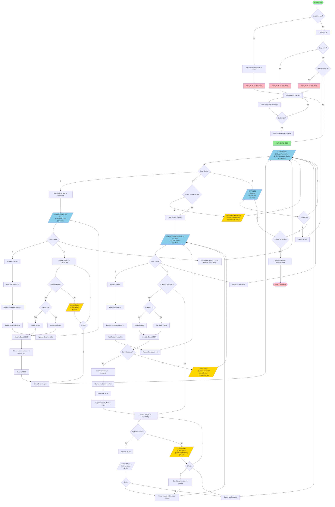

```mermaid
flowchart TD
    Start([System Start]) --> CheckCred{cred.txt exists?}
    
    CheckCred -->|No| CreateCred[Create cred.txt with null values]
    CreateCred --> NotAuth1[NOT_AUTHENTICATED]
    
    CheckCred -->|Yes| LoadCred[Load cred.txt]
    LoadCred --> CheckKeys{Keys exist?}
    
    CheckKeys -->|No| NotAuth2[NOT_AUTHENTICATED]
    CheckKeys -->|Yes| CheckValues{Values non-null?}
    
    CheckValues -->|No| NotAuth3[NOT_AUTHENTICATED]
    CheckValues -->|Yes| Auth[AUTHENTICATED]
    
    NotAuth1 --> LoginScreen[Display Login Screen]
    NotAuth2 --> LoginScreen
    NotAuth3 --> LoginScreen
    
    LoginScreen --> EnterCode[Enter temp code from app]
    EnterCode --> ValidateCode{Code valid?}
    ValidateCode -->|No| LoginScreen
    ValidateCode -->|Yes| SaveCreds[Save credentials to cred.txt]
    SaveCreds --> Auth
    
    Auth --> HomeMenu[/"HOME MENU
    [1] Scan Answer Key
    [2] Check Answer Sheets
    [3] Settings"/]
    
    HomeMenu --> HomeChoice{User Choice}
    
    %% OPTION 1: SCAN ANSWER KEY
    HomeChoice -->|1| AskQuestions[Ask: Total number of questions]
    AskQuestions --> ScanMenu1[/"SCAN ANSWER KEY
    [1] Scan
    [2] Done & Save
    [3] Cancel"/]
    
    ScanMenu1 --> ScanChoice1{User Choice}
    
    ScanChoice1 -->|1| TriggerScan1[Trigger Scanner]
    TriggerScan1 --> Wait1[Wait 10s debounce]
    Wait1 --> Scanning1[Display: Scanning Page n...]
    Scanning1 --> WaitComplete1[Wait for scan complete]
    WaitComplete1 --> AddToList1[Append filename to list]
    AddToList1 --> ScanMenu1
    
    ScanChoice1 -->|2| UploadCloud1[Upload images to Cloudinary]
    UploadCloud1 --> UploadSuccess1{Upload success?}
    
    UploadSuccess1 -->|Yes| CheckMulti1{Images > 1?}
    CheckMulti1 -->|Yes| Collage1[Create collage]
    CheckMulti1 -->|No| SingleImg1[Use single image]
    Collage1 --> SendGemini1[Send to Gemini OCR]
    SingleImg1 --> SendGemini1
    
    SendGemini1 --> ExtractData1[Extract assessment_uid & answer_key]
    ExtractData1 --> SaveRTDB1[Save to RTDB]
    SaveRTDB1 --> DeleteLocal1[Delete local images]
    DeleteLocal1 --> HomeMenu
    
    UploadSuccess1 -->|No| UploadFail1[/"Upload failed
    [1] Re-upload
    [2] Exit"/]
    UploadFail1 --> UploadFailChoice1{Choice}
    UploadFailChoice1 -->|1| UploadCloud1
    UploadFailChoice1 -->|2| DeleteLocal1
    
    ScanChoice1 -->|3| Cancel1[Delete local images if list of filename is not None]
    Cancel1 --> HomeMenu
    
    %% OPTION 2: CHECK ANSWER SHEETS
    HomeChoice -->|2| CheckAnswerKeys{Answer keys in RTDB?}
    
    CheckAnswerKeys -->|No| NoKeys[/"No answer keys found
    Scan answer key first
    Press # to continue"/]
    NoKeys --> HomeMenu
    
    CheckAnswerKeys -->|Yes| LoadKeys[Load answer key data]
    LoadKeys --> ScanMenu2[/"CHECK ANSWER SHEETS
    [1] Scan
    [2] Done & Save
    [3] Cancel"/]
    
    ScanMenu2 --> ScanChoice2{User Choice}
    
    ScanChoice2 -->|1| TriggerScan2[Trigger Scanner]
    TriggerScan2 --> Wait2[Wait 10s debounce]
    Wait2 --> Scanning2[Display: Scanning Page n...]
    Scanning2 --> WaitComplete2[Wait for scan complete]
    WaitComplete2 --> AddToList2[Append filename to list]
    AddToList2 --> ScanMenu2
    
    ScanChoice2 -->|2| CheckGemini{is_gemini_task_done?}
    
    CheckGemini -->|No| CheckMulti2{Images > 1?}
    CheckMulti2 -->|Yes| Collage2[Create collage]
    CheckMulti2 -->|No| SingleImg2[Use single image]
    Collage2 --> SendGemini2[Send to Gemini OCR]
    SingleImg2 --> SendGemini2
    
    SendGemini2 --> GeminiSuccess{Gemini success?}
    
    GeminiSuccess -->|Yes| ExtractStudent[Extract student_id & answers]
    ExtractStudent --> CompareAnswers[Compare with answer key]
    CompareAnswers --> CalcScore[Calculate score]
    CalcScore --> SetGeminiDone[is_gemini_task_done = True]
    SetGeminiDone --> UploadCloud2
    
    GeminiSuccess -->|No| GeminiFail[/"Gemini failed
    Quota exceeded / Network error
    Press # to retry"/]
    GeminiFail --> ScanMenu2
    
    CheckGemini -->|Yes| UploadCloud2[Upload images to Cloudinary]
    
    UploadCloud2 --> UploadSuccess2{Upload success?}
    
    UploadSuccess2 -->|Yes| SaveStudent[Save to RTDB]
    SaveStudent --> ShowScore[/"Score: XX/YY
    [1] Next sheet
    [2] Exit"/]
    
    ShowScore --> ScoreChoice{Choice}
    ScoreChoice -->|1| ResetState[Reset state & delete local images]
    ResetState --> ScanMenu2
    ScoreChoice -->|2| DeleteLocal2[Delete local images]
    DeleteLocal2 --> HomeMenu
    
    UploadSuccess2 -->|No| UploadFail2[/"Upload failed
    [1] Re-upload
    [2] Proceed anyway
    [3] Exit"/]
    
    UploadFail2 --> UploadFailChoice2{Choice}
    UploadFailChoice2 -->|1| UploadCloud2
    UploadFailChoice2 -->|2| BgRetry[Start background retry process]
    BgRetry --> ResetState
    UploadFailChoice2 -->|3| DeleteLocal2
    
    ScanChoice2 -->|3| Cancel2[Delete local images]
    Cancel2 --> HomeMenu
    
    %% OPTION 3: SETTINGS
    HomeChoice -->|3| SettingsMenu[/"SETTINGS
    [1] Logout
    [2] Shutdown
    [3] Back"/]
    
    SettingsMenu --> SettingsChoice{User Choice}
    
    SettingsChoice -->|1| Logout[Clear cred.txt]
    Logout --> LoginScreen
    
    SettingsChoice -->|2| ConfirmShutdown{Confirm shutdown?}
    ConfirmShutdown -->|Yes| Shutdown[Safely shutdown Raspberry Pi]
    Shutdown --> End([System Shutdown])
    ConfirmShutdown -->|No| SettingsMenu
    
    SettingsChoice -->|3| HomeMenu
    
    style Start fill:#90EE90
    style End fill:#FFB6C1
    style Auth fill:#90EE90
    style NotAuth1 fill:#FFB6C1
    style NotAuth2 fill:#FFB6C1
    style NotAuth3 fill:#FFB6C1
    style HomeMenu fill:#87CEEB
    style ScanMenu1 fill:#87CEEB
    style ScanMenu2 fill:#87CEEB
    style SettingsMenu fill:#87CEEB
    style NoKeys fill:#FFD700
    style GeminiFail fill:#FFD700
    style UploadFail1 fill:#FFD700
    style UploadFail2 fill:#FFD700
```