## Directory Structure

**ENV**

Get the .env here in this [link](https://drive.google.com/drive/folders/1fnYoMi5BEu9EHZJuhX6MIntBcn0Fwjr8?usp=sharing).

**Note:** You should rename the api.txt into .env


**Recommend Directory Structure**

```
raspi_code/
├─ logs/
├─ README.md
├─ GOAL.md
├─ .env
├─ test/
├─ main.py                     
└─ lib/
   ├─ services/
   |  ├─ firebase_rtdb.py
   |  ├─ handle_pairing.py
   |  └─ handle_hardware.py
   └─ processes/
      ├─ process_a.py
      ├─ process_b.py
      └─ process_c.py
```

## Guidelines handling image for Gemini API 

**Image Size Guidelines for Gemini API**

When combining multiple pages into a single grid for Gemini OCR:

| Parameter	| Recommendation	| Notes |
| --- | --- | --- |
| Minimum per-page width	| 300 px	| Any smaller → OCR accuracy may drop; letters may be misread |
| Optimal per-page width	| 400–600 px	| Safe range for text clarity and high accuracy |
| Maximum per-page width	| 1200 px	| Larger → may hit API request size limits, slower processing |
| Tile height	| 1.4 × width	| Maintains typical page aspect ratio (e.g., 400×560 px) |
| Final combined image size	| ≤ 1.5 MB	| Helps avoid hitting Gemini API request size limits |

**Notes:**

- Per-page width refers to each individual page inside the combined grid.

- Tile height is automatically calculated based on width to maintain readable aspect ratio.

- If combining many pages, reduce tile width or compress image to fit API limits.

- Keep in mind: lower resolution → smaller file but lower OCR accuracy.


**Grid Layout & Pixel Size Guide**

```
Number of pages → Grid layout → Per-page width × height (px)
-------------------------------------------------------------
1 page   → 1×1   → 400 × 560
2 pages  → 2×2   → 400 × 560 each (2 blanks)
3 pages  → 2×2   → 400 × 560 each (1 blank)
4 pages  → 2×2   → 400 × 560 each
5 pages  → 3×3   → 400 × 560 each (4 blanks)
6 pages  → 3×3   → 400 × 560 each (3 blanks)
7 pages  → 3×3   → 400 × 560 each (2 blanks)
8 pages  → 3×3   → 400 × 560 each (1 blank)
9 pages  → 3×3   → 400 × 560 each
```

**Notes:**

- Per-page width: 300–600 px is safe for OCR.

- Per-page height: 1.4 × width keeps normal page ratio.

- Tile width 400 px is default for balance between clarity and file size.

- Blanks are added automatically to fill empty slots.

- Final combined image: try to stay ≤ 1.5 MB to avoid Gemini API limits.


**A visual diagram with rectangles representing each page in the grid for 1–9 pages.**

```mermaid
%% Visual Grid Layout for 1–9 Pages
flowchart TB
    style Page1 fill:#a2d2ff,stroke:#000,stroke-width:1px
    style Page2 fill:#a2d2ff,stroke:#000,stroke-width:1px
    style Page3 fill:#a2d2ff,stroke:#000,stroke-width:1px
    style Page4 fill:#a2d2ff,stroke:#000,stroke-width:1px
    style Page5 fill:#a2d2ff,stroke:#000,stroke-width:1px
    style Page6 fill:#a2d2ff,stroke:#000,stroke-width:1px
    style Page7 fill:#a2d2ff,stroke:#000,stroke-width:1px
    style Page8 fill:#a2d2ff,stroke:#000,stroke-width:1px
    style Page9 fill:#a2d2ff,stroke:#000,stroke-width:1px
    style Blank fill:#ffffff,stroke:#000,stroke-width:1px

%% 1 Page
subgraph "1 page (1x1)"
    Page1["Page 1"]
end

%% 2 Pages
subgraph "2 pages (2x2)"
    Page1_2["Page 1"] --> Page2_2["Page 2"]
    Blank1_2["Blank"] --> Blank2_2["Blank"]
end

%% 3 Pages
subgraph "3 pages (2x2)"
    Page1_3["Page 1"] --> Page2_3["Page 2"]
    Page3_3["Page 3"] --> Blank1_3["Blank"]
end

%% 4 Pages
subgraph "4 pages (2x2)"
    Page1_4["Page 1"] --> Page2_4["Page 2"]
    Page3_4["Page 3"] --> Page4_4["Page 4"]
end

%% 5 Pages
subgraph "5 pages (3x3)"
    Page1_5["Page 1"] --> Page2_5["Page 2"] --> Page3_5["Page 3"]
    Page4_5["Page 4"] --> Page5_5["Page 5"] --> Blank1_5["Blank"]
    Blank2_5["Blank"] --> Blank3_5["Blank"] --> Blank4_5["Blank"]
end

%% 6 Pages
subgraph "6 pages (3x3)"
    Page1_6["Page 1"] --> Page2_6["Page 2"] --> Page3_6["Page 3"]
    Page4_6["Page 4"] --> Page5_6["Page 5"] --> Page6_6["Page 6"]
    Blank1_6["Blank"] --> Blank2_6["Blank"] --> Blank3_6["Blank"]
end

%% 7 Pages
subgraph "7 pages (3x3)"
    Page1_7["Page 1"] --> Page2_7["Page 2"] --> Page3_7["Page 3"]
    Page4_7["Page 4"] --> Page5_7["Page 5"] --> Page6_7["Page 6"]
    Page7_7["Page 7"] --> Blank1_7["Blank"] --> Blank2_7["Blank"]
end

%% 8 Pages
subgraph "8 pages (3x3)"
    Page1_8["Page 1"] --> Page2_8["Page 2"] --> Page3_8["Page 3"]
    Page4_8["Page 4"] --> Page5_8["Page 5"] --> Page6_8["Page 6"]
    Page7_8["Page 7"] --> Page8_8["Page 8"] --> Blank1_8["Blank"]
end

%% 9 Pages
subgraph "9 pages (3x3)"
    Page1_9["Page 1"] --> Page2_9["Page 2"] --> Page3_9["Page 3"]
    Page4_9["Page 4"] --> Page5_9["Page 5"] --> Page6_9["Page 6"]
    Page7_9["Page 7"] --> Page8_9["Page 8"] --> Page9_9["Page 9"]
end
```

